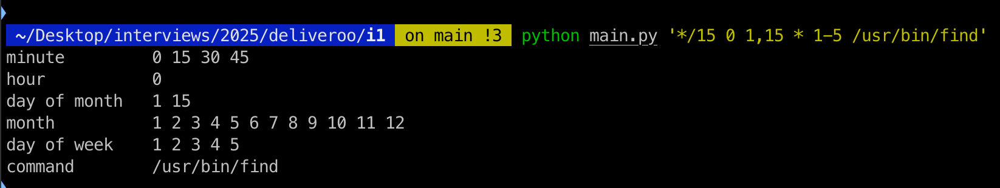

# Cron Expression Parser

A **command-line application** that **parses cron expressions**, expands each field, and prints a formatted output.  
It includes **unit tests** and **code coverage reports**.

---

## **Installation**

### **Create a Virtual Environment**
```sh
python -m venv venv
source venv/bin/activate  # macOS/Linux
```

### **Install Dependencies**
```sh
pip install -r requirements.txt
```

---

## **📌 Running the Cron Parser**
### **Using `Makefile`**
```sh
make run-sample
```

### **Without `Makefile`**
```sh
python main.py '*/15 0 1,15 * 1-5 /usr/bin/find'
```

---

## **Running Tests**
### **Using `Makefile`**
```sh
make test  # Runs all tests with debug output
```

### **Without `Makefile`**
```sh
pytest -s
```

---

## **Checking Code Coverage**
### **Generate and View an HTML Report**
```sh
make coverage-html
```
Then, open `htmlcov/index.html` in a browser.

### **View Coverage in Terminal**
```sh
make coverage-terminal
```

### **Without `Makefile`**
```sh
pytest --cov=cron_parser --cov-report=html  # Generates HTML report
pytest --cov=cron_parser --cov-report=term  # Displays in terminal
```

---

## **Project Structure**
```
/cron-parser
│── cron_parser/
│   ├── constants.py        # Defines field names and valid ranges
│   ├── utils.py            # Expands cron fields into time lists
│   ├── parser.py           # Parses the cron expression and formats output
│── tests/
│   ├── test_parser.py      # Tests for parser functions
│   ├── test_utils.py       # Tests for utils (expand_field)
│   ├── test_constants.py   # Tests for constants
│── test_data/
│   ├── crons.json          # Sample cron test cases
│   ├── expand_fields.json  # Test cases for utils.py
│── Makefile                # Easy commands for running tests and coverage
├── main.py                 # CLI entry point
│── requirements.txt        # Python dependencies
│── README.md               # Documentation
```

---

## **Example Cron Expression**
### **Input**
```sh
python main.py '*/15 0 1,15 * 1-5 /usr/bin/find'
```

